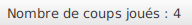

= Document de synthèse Projet Memory
:toc-title: Table des matières
:toc:
:title-page:
:sectnums:
:title-logo-image: image:/Logo_IUT_Blagnac.png[]
:stem: asciimath
Emilien FIEU 3B

== Fonctionalitées minimales

=== Mode de triche

Le mode de triche est disponible dans Options>Mode triche

== Options de base

=== Permettre de faire plusieurs parties

Le jeu permet de faire plusieurs parties, en effet, après chaque parties, le jeu vous demande si vous voulez refaire une partie

=== Compter et afficher un score

Le jeu compte le score du joueur au cours de la partie et l’affiche dans la barre de menu en haut de l’écran

Le jeu l’affiche aussi dans une pop up à la fin de la partie

=== Permettre de jouer à 2 joueurs

Le jeu permet de jouer à deux joueurs, en effet, vous pouvez selectionner le nombre de joueurs dans le menu Options>Nombre de joueurs

Lorsque vous jouez à deux, le jeu vous affiche le score des deux joueurs au même endroit que pour un joueur

Le jeu vous affiche également le gagnant à la fin de la partie

Le jeu vous montre également le joueur qui doit jouer

=== Permettre de choisir la taille du plateau

Le jeu permet de choisir la taille du plateau, en effet, vous pouvez selectionner la taille du plateau dans le menu Options>Taille du plateau.

Vous pouvez choisir entre :

* 2x2
* 4x4
* 6x6
* 8x8
* 10x10
* 12x12
* 14x14
* 16x16
* 18x18
* 20x20

=== Permettre de choisir le thème des cartes

Le jeu permet de choisir le thème des cartes, en effet, vous pouvez selectionner le thème des cartes dans le menu Options>Type de cartes.

Vous pouvez choisir entre :

.Chiffres

.Lettres

.Items de Minecraft

.Smileys

Ces 4 modes ont suffisamment de cartes différentes pour pouvoir jouer en mode 20x20. Le mode Lettres, utilisera des caractères spéciaux en plus lorsqu’il n’aura plus assez de lettres pour remplir le plateau.

== Options supplémentaires

=== Différents tracé du mode triche

Le mode triche permet de ne pas mélanger les cartes. Mais le jeu propose plusieurs tracés différents pour le mode triche. Vous pouvez choisir le tracé dans le menu Options>Mode de tracé

Vous pouvez choisir entre :

.Horizontal

.Vertical

.Spirale

=== Confirmation avant de quitter

Le jeu propose une confirmation avant de quitter, en effet, lorsque vous cliquez sur le bouton Quitter ou sur la croix, le jeu vous demande si vous êtes sûr de vouloir quitter

